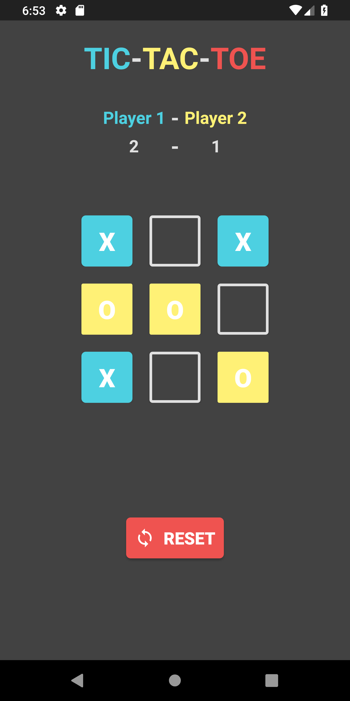

# TicTacToe
Basically a normal X-O game with multiplayer feature

---

**Phase-1**
UI design completed based on material design

---

**Phase-2**
Basic working logic completed 
just eradicated the use of paper

---
